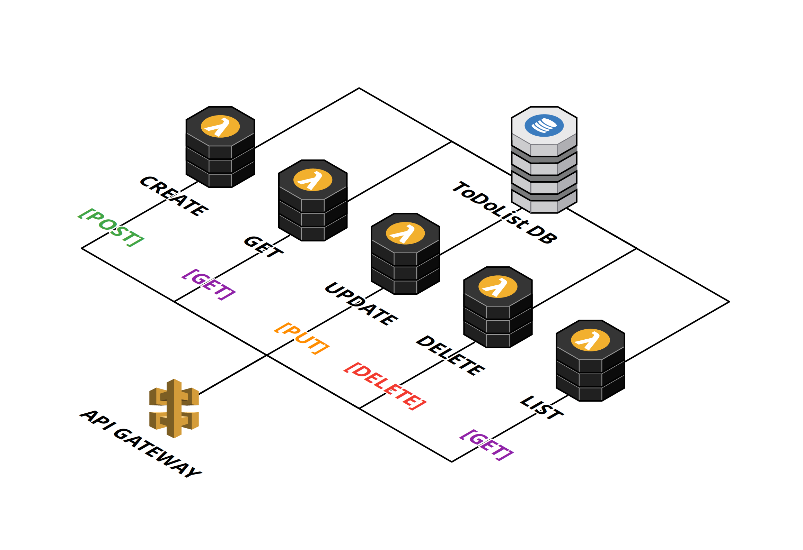

# Chris Connor Honours Project
This repo contains the code, tests and results for my 4th Year Honours Project at Glasgow Caledonian University.

My project was an investigation into serverless computing with AWS Lambda, and how the choice of runtime can impact the cold start issue.

# Research Question
>"Does the choice of runtime have an impact on the Cold Start problem with Serverless architecture?"

# Architecture Overview
The architecture inolves an API Gateway instance which directs requests out to 5 different lambda functions.



## Deployment instructions
You *must* have the [Serverless Framework](http://serverless.com/) installed to deploy these to AWS.

You will also need an [Amazon Web Services](http://aws.amazon.com/) account.

To deploy all instances to AWS, run the follow command from the root of the project.
```
$: ./deploy.sh
```

*Note:* There must be a JAR file which has been built for the Java API. If not, you can build using Maven:
```
$: mvn clean install
```

If you already deployed and got an error using java you can re-deploy with the following comman:
```
$: cd ./java-api
$: sls deploy
```

# Removal
Similarly, to remove the API's from deployment you can run the following command

```bash
$: ./remove.sh
```
and
```bash
$: ./memory_remove.sh
```

# Accessing the API Public

If at any point to you need to access the API and don't have the details. You can navigate to any of the API's and run the following command

```bash
sls info
```

This will return something like the following to give you all the required information.

```bash
Service Information
service: java-todo-api
stage: java-dev
region: eu-west-2
stack: java-todo-api-java-dev
api keys:
  None
endpoints:
  POST - https://[unique_id_here].execute-api.eu-west-2.amazonaws.com/java-dev/todos
  GET - https://[unique_id_here].execute-api.eu-west-2.amazonaws.com/java-dev/todos/{id}
  GET - https://[unique_id_here].execute-api.eu-west-2.amazonaws.com/java-dev/todos
  PUT - https://[unique_id_here].execute-api.eu-west-2.amazonaws.com/java-dev/todos/{id}
  DELETE - https://[unique_id_here].execute-api.eu-west-2.amazonaws.com/java-dev/todos/{id}
  ```
